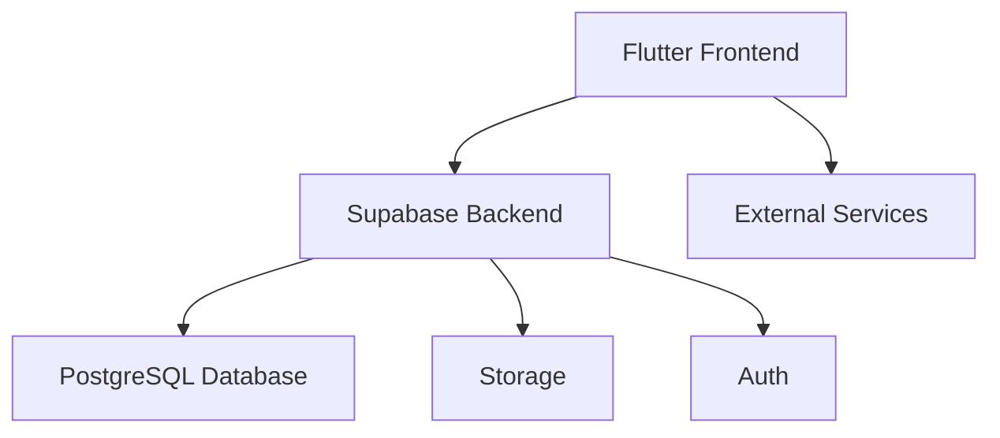

# Arquitectura del Sistema

Sophia App sigue una arquitectura modular y escalable, basada en los siguientes componentes principales:

## 1. Frontend

Desarrollado en Flutter, permite una experiencia de usuario consistente en múltiples plataformas.

## 2. Backend

Supabase gestiona la autenticación, base de datos y almacenamiento, facilitando la integración y escalabilidad.

## 3. Base de Datos

PostgreSQL almacena la información de usuarios, retos, progreso y análisis.

## 4. Integraciones

Preparado para conectar con servicios externos (calendarios, apps de salud, redes sociales) en futuras versiones.

## 5. CI/CD

GitHub Actions y Docker aseguran despliegues automáticos y controlados.

### Diagrama de Arquitectura

Esta arquitectura permite escalar el producto y añadir nuevas funcionalidades de forma ágil y segura.
